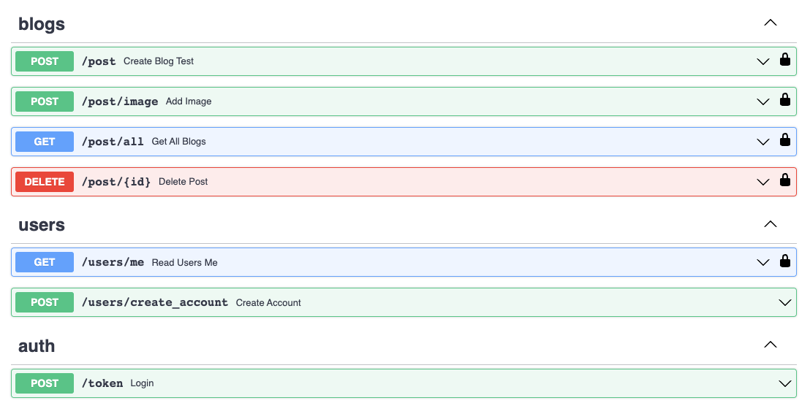

# About
**Tech Stack**: Python, FastAPI, OAuth2, EC2, Docker, Streamlit, SqlAlchemy, Sqlite.

I wanted to create a simple blog post website that allows for users to view all the current blogs,
post their own blogs and delete blogs. To use the site you'll have to create an account.

WARNING: There is currently no filter for NSFW content, this feature is coming soon.

The site can be found here: http://ec2-13-53-56-159.eu-north-1.compute.amazonaws.com/

## Overview

**Login Page**

When you reach the site you'll have to create an account or sign in. When creating an account the password will be 
encrypted in the database for security, this means that even if you have access to the database you won't be able
to figure out the password.

Once you create an account it will be automatically authenticated, meaning you don't need to login again for the next
30 minutes.

Note: you wont be able to access the home page without logging in.

**Home Page**

The image below shows the home page for the website, it contains all the current blogs in the database.
If a new blog is added it will immediately show up here, no need for refreshing.

**Create Post**

Use the `Create Post` tab to create a new post. Users have the option to add images to their posts. Each new post
is given a unique ID in the backend and the contents is saved in the `Blogs` table, the images are saved as static
files and their URLs are saved in the `Blogs` table.

**Delete Post**

Posts can only be deleted by the person who created them, the post id needs to be referenced so the 
backend knows what post to delete. When deleting a post a delete image method is also called, this will
only apply to posts with images.

## API:

The API was built using FastAPI with the following endpoints:

## Run it locally:

Make sure docker and python is installed (using python 3.11)

1. `git clone https://github.com/RamonJWS/fast-api-blog`
2. `cd fast-api-blog`
3. `docker-compose up -d`
4. Open a web browser and type in `localhost:8501`

The backend will create a local db called blog.db, this is a sqlite database which can be viewed with
TablePlus if needed.

## Improvements:

- Add DNS and VPC to AWS infrastructure.
- Add in NSFW text and image classification for unwanted content.
- Add in update method for posts.
- Add in upvotes and comments to posts.
